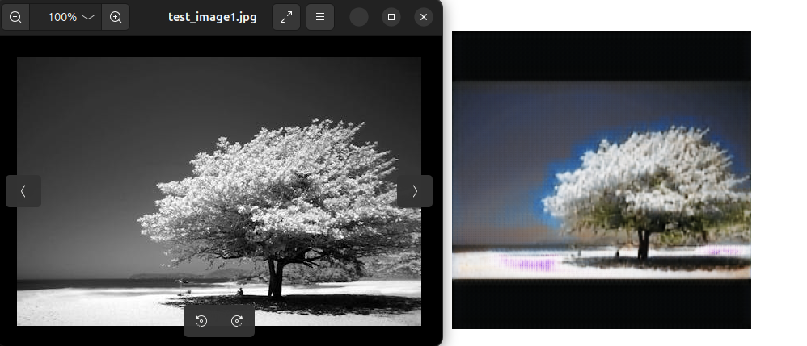

# Image-Colourizer
This is a project that designs and creates a small Neural Network using Convolutional Neural Networks with the purpose of learning to colourize black and white (grayscale) images.

Current training has been halted as 90 epochs with an L1 loss of ~0.07
    - model included in checkpoints dir

Prior to the use of the downloaded images, the images were all resized to 256x256 images. The transformation is performed by the 'data_transformer.py' file. On top of resizing, the 'data_transformer.py' file performs rotational data augmentation. (View Regularization section)

Training is performed on 256x256 images, as such, it is expected that the model would perform best on images with size 256x256.

## Model
    - Convolutional Neural Network
    - Follows the encoder decoder architecture to learn 'useful' features
    - Can be viewed in 'Model_CNN.py' file

## Activation Function(s)
    - Rectified Linear Unit (ReLu)

## Loss Function
    - L1 loss with batch size 30

## Regularization
    - L2 regularization (which encourages smaller weight values by penalizing large weights). Although it wasn't used in the provided model.
    - The use of batches technically results in regularization since the update step is performed based on the average loss across a subset of the dataset - introducing noise.
    - Data Augmentation 1: Rotation was included in the data preprocessing. The Augmented data was used as part of the training data.
    - TODO Data Augmentation 2: Multi Scale data augmentation to train the model to intake images of different sizes.

## Optimizer
    - Adam optimizer is used to update the model parameters at every step while considering the exponential moving average of gradients (similar to momentum), exponential moving squared average of gradients (used to adapt the learning rate), and adaptively correcting the learning rate.

## Use of Batches
    - We use batches of size 30 to improve learning efficiency.

## Normalization
    Batch normalization is performed after every 2d convolution layer.
    - Normalizes the values for each channel dimension to fit a mean of 0 and a variance of 1
    - Helps stabilize training.

## Train Data
    - Bing downloader was used to download the train and test data. Further details can be viewed in the 'dataset.py' file
    - Downloaded images were browsed and downloaded using the following parameters:
        "animals", "people", "cars", "buildings", "trees", "mountains", "beaches", "food",
        "oceans", "rivers", "lakes", "deserts", "cities", "night", "moon", "clouds",
        "rain", "snow", "storm", "fog", "wind", "tornado", "hurricane", "earthquake", 
        "volcano", "tsunami", "fire", "ice", "water", "air", "earth", "space",
        "universe", "galaxy", "planet", "winter", "spring", "summer", "autumn", 
        "flowers", "peoples faces"
    - queries can be found in the 'queries_for_download.py' file
    - The use of data loader allows to use batches with random data samples for training efficiently.
    - Some of the data was manually filtered based on the "appropriateness" of the images for the training of the model.
    - Transformed training dataset has been included and produced by 'data_transformer.py'
